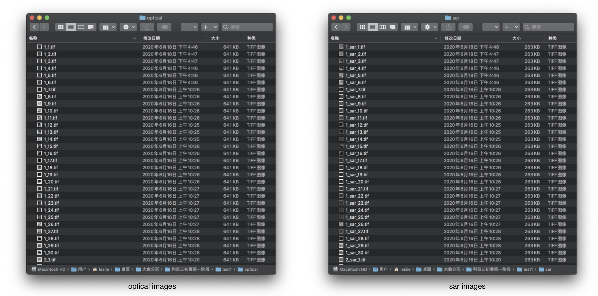
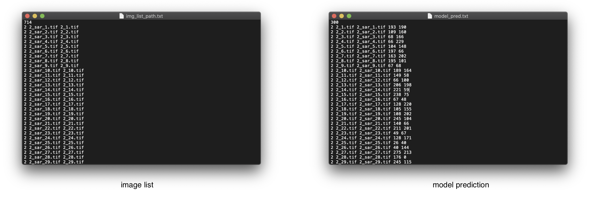

# Simply-Drag-N-Drop
This tool displays two images, you could drag one of them and would be able to save the coordinates of the upper left corner of the smaller picture in the larger picture. Developers can check the prediction results of the CNN model in image registration. This tool supports changing the transparency of the image to facilitate the observation and comparison of image characteristics.

## Setup on which the code was tested
- python==3.7
- pandas==0.25.3
- Pillow==8.0.1

## Usage
To run this tool, simply specify the path of the data folder using   
`SimplyDragNDrop.py -path PATH-TO-DATA`  

The frame of the file should be like this:  

  
  
Files including image folders: 1. `optical` and `sar` ｜ 2. `img_list_path.txt`: image list or model prediction results.

1. Image file, including optical image (optical) and synthetic aperture radar image (sar)   
  

2. `.txt` file, image list or model prediction file  
  

##### Note
When a `.txt` has coordinates, the Simply Drag and Drop tool will read the coordinates in the file and print the images according to the coordinates given.

## Feartures

The optical remote sensing image (big one) and SAR image (small one) are displayed respectively, and the following display:

1. The column coordinates of the upper left corner of the current SAR image in the visible image (Coordinate X) and the row coordinates of the upper left corner of the SAR image in the visible image (Coordinate Y)

2. The name of the current optical image and the name of the SAR image

### keyboard input

### Saving the coordinates
You can press `<s>` to save the coordinate. The coordinate file can be saved as `.csv` and `.txt`, and the historical saved coordinates are displayed in the console.  
  

## Issues
It is recommended to run the Simply Drag and Drop tool on a display screen larger than 20 inches. The display effect is inconsistent on screens of different sizes, and the display will be incomplete on smaller screens, regardless of the resolution.
  
## Contact
The above is the description of all the functional requirements of the Simply Drag and Drop tool. If you encounter unclear or controversial issues, feel free to contact [Leslie Wong](yushuowang@gmail.com).