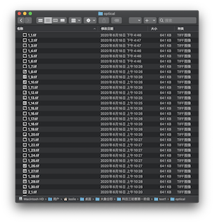

# Simply-Drag-N-Drop
This tool provides intuitive image output and coordinate point positioning. Developers can check the prediction results of the model and the corresponding coordinate points, and can choose whether to record the current coordinate points. This tool supports changing the transparency of the image to facilitate the observation and comparison of image characteristics.

## Setup on which the code was tested
- python==3.7
- pandas==0.25.3
- Pillow==8.0.1

## Usage
To run this tool, simply specify the path of the data folder using
`SimplyDragNDrop.py -path PATH-TO-DATA`  

The path of the data file should be like this:  
  

Data files include image folders (necessary): 1. optical and sar ｜ 2. img_list_path.txt: image list or model prediction results

1. Image file, divided into optical image (optical) and synthetic aperture radar image (sar)   
  

    

2. .txt file, image list or model prediction file  

    

About the model prediction file:

When a model file with coordinates is given, the Simply Drag and Drop tool will read the coordinates in the file and print the position of the picture according to the coordinates.

As can be seen from the above figure, the difference between the image list and the model prediction file is whether it contains coordinate points. Each time you run the Simply Drag and Drop tool, you need to specify it as a path, and the Simply Drag and Drop tool will automatically recognize and display the image.

Note: Pay attention to the order of file names.

## Feartures

The optical remote sensing image (large) and SAR image (small) are displayed respectively, and the following display:

1. The column coordinates of the upper left corner of the current SAR image in the visible image (Coordinate X) and the row coordinates of the upper left corner of the SAR image in the visible image (Coordinate Y)

2. The name of the current visible light image and the name of the SAR image

#### keyboard input

#### Saving the coordinates
The coordinate file can be saved as csv format and txt format, and the historical saved coordinates are displayed in the console.

## Issues
It is recommended to run the Simply Drag and Drop tool on a display screen larger than 20 inches. The display effect is inconsistent on screens of different sizes, and the display will be incomplete on smaller screens, regardless of the resolution.
## Contact
The above is the description of all the functional requirements of the Simply Drag and Drop tool. If you encounter unclear or controversial issues, feel free to contact [Leslie Wong](yushuowang@gmail.com).